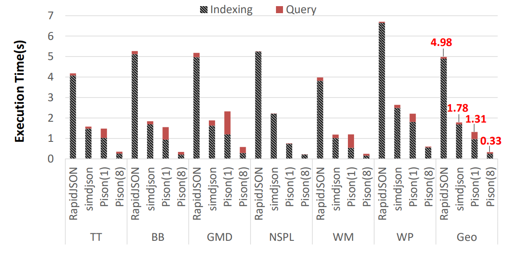
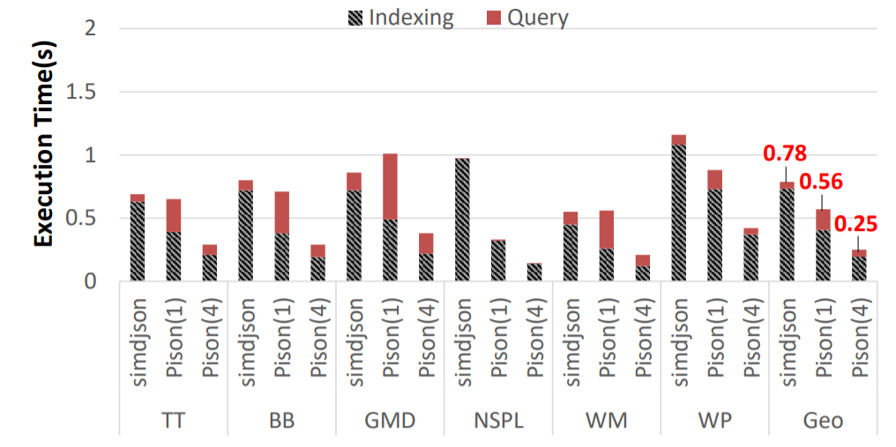
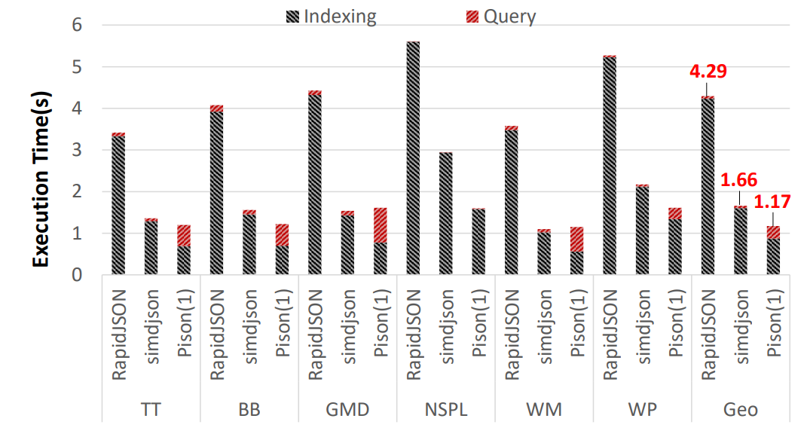
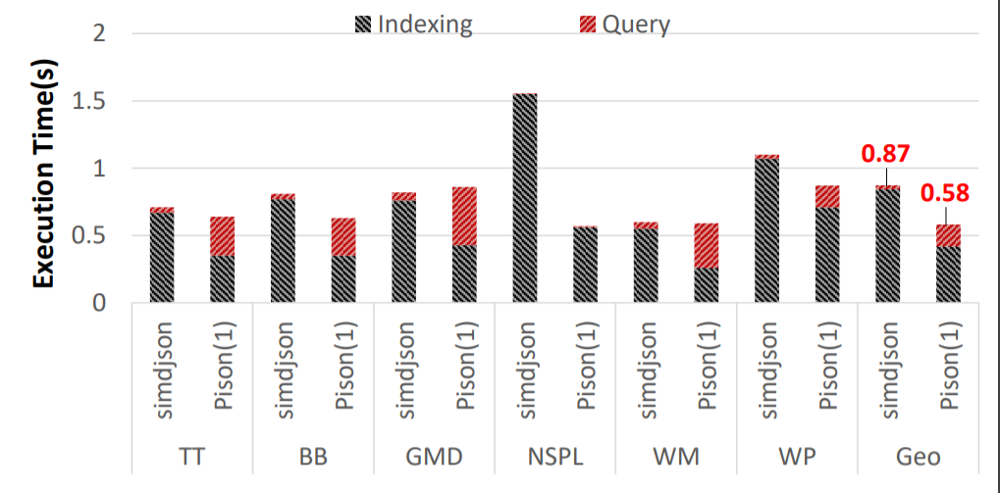

# Pison
Pison builds structural index (bitmaps for colon and comma of different levels) for JSON records to accelerate JSON analytics. 
It leverages both coarse-grained (multicore) parallelism and fine-grained (bitwise and SIMD) parallelism to make index construction efficient.
For more details about Pison, please refer to our paper [1].

The original idea of JSON structural index construction was proposed in Mison [2]. The major improvement of Pison over Mison is the capability of building structure index for **a single large JSON record** in parallel. In addition, it optimizes the index construction steps, including adopting some bitwise operations used in [simdjson](https://github.com/simdjson/simdjson), to further enhance the performance. 

## Publications
[1] Lin Jiang, Junqiao Qiu, Zhijia Zhao. Scalable Structural Index Construction for JSON Analytics. PVLDB, 14(4):694-707, 2021.

[2] Yinan Li, Nikos R. Katsipoulakis, Badrish Chandramouli, Jonathan  Goldstein, D. Kossmann. Mison: A Fast JSON Parser for Data Analytics. PVLDB, 10(10): 2017.

## Getting Started
### Prerequisites
- **Hardware**: CPU processors should support `64-bit ALU instructions`, `256-bit SIMD instruction set`, and the `carry-less multiplication instruction (pclmulqdq)`
- **Operating System**: `Linux`
- **C++ Compiler**: `g++` (7.4.0 or higher)

### Dataset
Four sample datasets are included in `dataset` folder. Large datasets (used in performance evaluation) can be downloaded from https://drive.google.com/drive/folders/1KQ1DjvIWpHikOg1JgmjlSWM3aAlvq-h7?usp=sharing and placed into the `dataset` folder. 

### Examples
A few examples (in `cpp` files) are provided in the `example` folder. They demostrate how to use our APIs to implement JSON queries. To create and test your examples, please update the `makefile` accordingly.

### Build
  ```
  make clean
  make all
  ```
### Run
Assume executable example file is `example1`.
  ```
  cd bin
  ./example1
  ```

## Performance Results
We compared Pison with [RapidJSON](https://github.com/Tencent/rapidjson) and [simdjson](https://github.com/simdjson/simdjson) for processing (i) a single bulky JSON record and (ii) a sequence of small JSON records. These datasets include Best Buy (BB) product dataset, tweets (TT) from Twitter developer API, Google Maps Directions (GMD) dataset, National Statistics Post-code Lookup (NSPL) dataset for United Kingdom, Walmart (WM) product dataset, and Wikipedia (WP) entity dataset. Each dataset is a single large JSON record of approximately 1GB. Small records are extracted from the dominating array (a large array consists with sub-records) in each dataset, and are delimited by newlines. For each dataset, we created a JSONPath query, listed in the following table (for bulky records made of small records, an additional prefix `[*]` is added):

| ID                  |   JSONPath Query                     |    Number of Matches   |
| :-----------------: |:---------------------------| :---------------------:|
| TT                  |   `{$.user.lang, $.lang}`     |    300,270            |
| BB                  |   `{$.categoryPath[1:3].id}`  |    459,332            |
| GMD                 |   `{$.routes[*].legs[*].steps[*].distance.text}`  |    1,716,752            |
| NSPL                       | `{$.meta.view.columns[*].name}`     |    44     |
| WM                    | `{$.bestMarketplacePrice.price, $.name}`      |   288,391  |
| WP                       | `{$.claims.P150[*].mainsnak.property}`          |  15,603  |


All experiments were conducted on two Xeon servers: 
- **[Server 1]**: a 16-core machine equipped with two Intel 2.1GHz Xeon E5-2620 v4 CPUs and 64GB RAM. 
- **[Server 2]**: a 4-core machine equipped with an Intel 3.5GHz Xeon E3-1240 v5 CPUs and 16GB RAM. 

The following two figures report the exeuction time (including both the index construction and the query evaluation) for bulky JSON record processing. Overall, both Pison and simdjson outperform RapidJSON, thanks to the use of SIMD and bitwise parallelism. The performance of serial Pison is comparable to simdjson, while parallel Pison achieves 5.4X and 3.1X speedups (on average) over simdjson on Server 1 (with 8 threads) and Server 2 (with 4 threads), respectively. 

<figcaption style="text-align:center"><b>Fig.1 - Execution Time of Processing A Single Large Record (Server 1).</b></figcaption>
<br/>
</img>

<figcaption style="text-align:center"><b>Fig.2 - Execution Time of Processing A Single Large Record (Server 2).</b></figcaption>
<br/>
</img>


In the scenario of small records processing, parallelism can be easily achieved at the task level (i.e., processing different records in parallel), so we only report the serial performance of Pison. Overall, performance results are consistent with those in large record processing.

<figcaption style="text-align:center"><b>Fig.3 - Execution Time of Processing A Sequence of Small Records (Server 1).</b></figcaption>
<br/>
</img>

<figcaption style="text-align:center"><b>Fig.4 - Execution Time of Processing A Sequence of Small Records (Server 2).</b></figcaption>
<br/>
</img>

More detailed evaluation can be found in our VLDB'21 paper (see reference above).

## APIs
### Records Loading (Class: RecordLoader)
- `static Record* loadSingleRecord(char* file_path)`: loads the whole input file as one single record (allow newlines in strings and other legal places). 
- `static RecordSet* loadRecords(char* file_path)`: loads multiple records from the input file (all newlines are treated as delimiters; no newlines (except for `\n` and `\r` in JSON strings) are allowed within a record); `RecordSet` can be accessed in array style (see `example3.cpp` and `example4.cpp` in `example` folder).
### Generating Leveled Bitmap Indices (Class: BitmapConstructor)
- `static Bitmap* construct(Record* record, int thread_num = 1, int level = MAX_LEVEL)`: constructs leveled bitmaps for a single record in parallel (indicated by `thread_num`); bitmap indices can be created based on the maximum level of given queries (indicated by `level` (starting from 0)).
- `static BitmapIterator* getIterator(Bitmap* bi)`: creates iterator for bitmap indices.
### Bitmap Indices Iterator (Class: BitmapIterator)
- `BitmapIterator* getCopy()`: gets a copy of an iterator (used for parallel accessing).
- `bool down()`: moves to the lower level of the leveled bitmaps.
- `bool up()`: moves to the upper level of the leveled bitmaps.
- `bool isObject()`: checks if the iterator points to an object.
- `bool isArray()`: checks if the iterator points to an array.
- `bool moveToKey(char* key)`: moves to the corresponding key field inside the current object.
- `bool moveToKey(unordered_set<char*>& key_set)`: moves to one of the corresponding key fields inside the current object.
- `bool moveToIndex(index) `: moves to a specific element in the current array.
- `bool moveNext()`: moves to the next element in the current array.
- `char* getValue()`: gets the value/element of the current key/array index.
- `int numArrayElements()`: gets the number of elements inside the current array.
