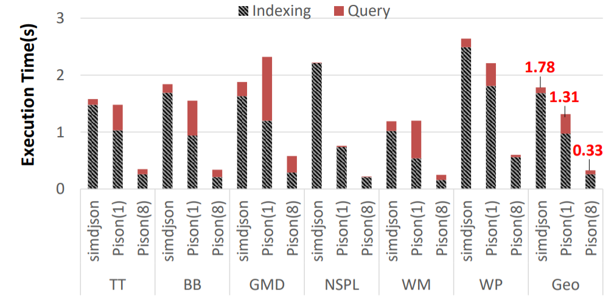
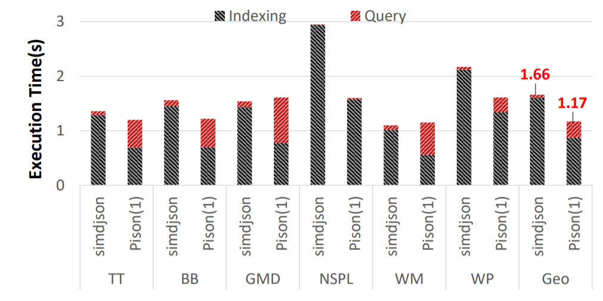

# Pison
Pison builds structural index (in bitmaps) for JSON records to accelerate JSON analytics. 
It leverages both coarse-grained (multicore) parallelism and fine-grained (bitwise and SIMD) parallelism to make index construction efficient.
For more details about Pison, please refer to our paper [1].

The original idea of JSON structural index construction was proposed in Mison [2]. The major improvement of Pison over Mison is the capability of building structure index for **a single large JSON record** in parallel. In addition, it optimizes the index construction steps, including adopting some bitwise operations used in [simdjson](https://github.com/simdjson/simdjson), to further enhance the performance. 

## Publications
[1] L. Jiang, J. Qiu, Z. Zhao. Scalable Structural Index Construction for JSON Analytics. PVLDB, 14(4): 2021.

[2] Y. Li, N. R. Katsipoulakis, B. Chandramouli, J. Goldstein, and D. Kossmann. Mison: a fast JSON parser for data analytics. PVLDB, 10(10): 2017.

## Getting Started
### Prerequisites
- **Hardware**: CPU processors should support `64-bit ALU instructions`, `256-bit SIMD instruction set`, and the `carry-less multiplication instruction (pclmulqdq)`
- **Operating System**: `Linux`
- **C++ Compiler**: `g++` (7.4.0 or higher)

### Dataset
Four sample datasets are included in `dataset` folder. Large datasets (used in performance evaluation) can be downloaded from https://drive.google.com/drive/folders/1KQ1DjvIWpHikOg1JgmjlSWM3aAlvq-h7?usp=sharing and placed into the `dataset` folder. 

### Examples
A few examples (in `cpp` files) are provided in the `example` folder. They demostrate how to use our APIs to implement JSON queries. To create and test your examples, please update the `makefile` accordingly.

### Build
  ```
  make clean
  make all
  ```
### Run
Assume executable example file is `example1`.
  ```
  cd bin
  ./example1
  ```

## Performance Results
We compared Pison with simdjson for processing a sequence of small JSON records and individual bulky JSON records in terms of processing time. These datasets include Best Buy (BB) product dataset, tweets from Twitter (TT) developer API, Google Maps Directions (GMD) dataset, National Statistics Post-code Lookup (NSPL) dataset for United Kingdom, Walmart (WM) product dataset, and Wikipedia (WP) entity dataset. Each dataset forms a single large JSON record, and the size is approximately 1GB. To create scenarios of small records processing, we manually extracted the dominating array (a large array consists with sub-records) from each dataset, broke it into smaller records, and inserted a new line after each small record, which is a common way to organize small JSON records. For each dataset, we created a single JSONPath query. All experiments were conducted on a 16-core machine equipped with two Intel 2.1GHz Xeon E5-2620 v4 CPUs and 64GB RAM. 

The following figure reports the exeuction time (including both index construction and query evaluations) for bulky JSON record processing using Pison and simdjson. Overall, the performance of serial Pison is comparable with simdjson. For index construction, Pison outperforms simdjson. But simdjson performs better for query evaluation, since the structure of bitmap indices generated from Pison requires both parsing and querying for certain tokens. On top of that, simdjson can not run in parallel, while Pison with 8 threads achieves 5.4X speedup over simdjson on average. 



As in the scenario of small records, parallelism can be easily achieved at the task level, so we only report the serial performance of Pison for fairness. The following figure shows the performance results of both methods, which are consistent with those in large record processing. 




## APIs
### Records Loading (Class: RecordLoader)
- `static Records* loadSingleRecord(char* file_path)`: loads the input file as one single record (newline delimeter is considered as a part of record). 
- `static Records* loadRecords(char* file_path)`: loads multiple records from the input file. 
### Generating Leveled Bitmap Indices (Class: BitmapConstructor)
- `static Bitmap* construct(Records* records, int rec_id, int thread_num = 1, int level = MAX_LEVEL, bool support_array = true)`: constructs leveled bitmaps for one specified record (indicated by `rec_id`) in parallel; bitmap indices can be created based on the maximum level of given queries (indicated by `level`). 
- `static BitmapIterator* getIterator(Bitmap* bi)`: creates iterator for bitmap indices.
### Bitmap Indices Iterator (Class: BitmapIterator)
- `BitmapIterator* getCopy()`: gets a copy of an iterator (used for parallel accessing).
- `bool down()`: moves to the lower level of the leveled bitmaps.
- `bool up()`: moves to the upper level of the leveled bitmaps.
- `bool isObject()`: checks if the iterator points to an object.
- `bool isArray()`: checks if the iterator points to an array.
- `bool moveToKey(char* key)`: moves to the corresponding key field inside the current object.
- `bool moveToKey(unordered_set<char*>& key_set)`: moves to one of the corresponding key fields inside the current object.
- `bool moveToIndex(index) `: moves to a specific element in the current array.
- `bool moveNext()`: moves to the next element in the current array.
- `char* getValue()`: gets the value/element of the current key/array index.
- `int numArrayElements()`: gets the number of elements inside the current array.
